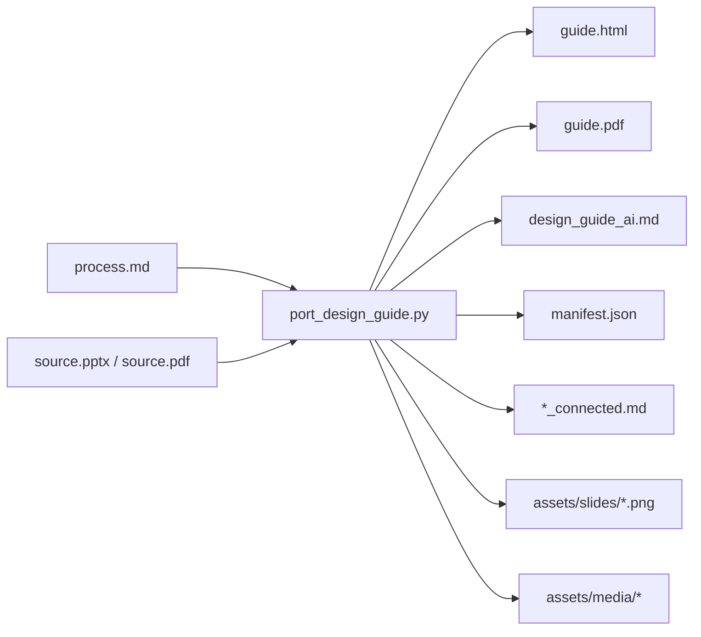

# 디자인 가이드 포팅 구조

> **현재 위상 (W31, 2026-07-21)**: 이 포팅 엔진(`port_design_guide.py`)은 여전히 살아 있고 `add-skin`(창고 **외부 이식** 경로)이 그대로 소비한다. 단, 용어가 갱신됐다 — **스킨(skin) = 프로젝트를 마친 run의 디자인 계약(`design_contract.json`)을 창고에 등록한 "졸업본"**이고, 이 문서가 다루는 외부 PPTX/PDF 포팅은 창고에 **입고하는 두 경로(①졸업=curate 등록 ②외부 이식=본 문서의 add-skin) 중 ②**에 해당한다. 창고 스킨은 **차용**(사용자 지시로 특정 run의 계약 초안으로 삼는 것) 없이는 자동 적용되지 않는다(구 "기본 스킨=inkline 자동 폴백"은 폐지). 상세 용어 정의 = `CONTEXT/JOURNEY.md`. 아래 본문(포팅 절차 자체)은 유효하며 개정하지 않는다.

이 문서는 PPTX/PDF 디자인 레퍼런스를 AI 학습용, Claude Design 참조용, 자동화 입력용 산출물로 변환하는 구조를 설명한다.

핵심은 역할 분리다.

```text
프로세스 MD = 분석 기준 / 판단 규칙 / QA 기준
입력 PPTX/PDF = 실제 디자인 레퍼런스
port_design_guide.py = 변환 엔진
포팅 산출물 폴더 = HTML/PDF/MD/JSON/이미지 자산 묶음
```

MD만으로 파일 렌더링이나 이미지 추출이 되는 것은 아니다. MD는 “어떻게 판단할지”를 고정하고, Python 변환 엔진은 “무엇을 재현 가능하게 생성할지”를 담당한다.

## 전체 흐름



## 입력

필수 입력은 두 가지다.

- `--process-md`: 디자인 가이드를 만들 때 따를 절차와 판단 기준이 담긴 Markdown
- `--source`: 분석할 `.pptx` 또는 `.pdf`

선택 입력:

- `--out`: 산출물 폴더
- `--title`: 산출물 제목

기본값은 기존 예시스튜디오 가이드에 맞춰져 있다.

```text
process-md: <개발 원본 전용 경로>
source: <개발 원본 전용 경로>
out: <개발 원본 전용 경로>
```

## 실행 예시

PPTX 입력:

```powershell
& '<로컬 사용자 경로>' `
  '<개발 원본 전용 경로>' `
  --process-md '<개발 원본 전용 경로>' `
  --source '<개발 원본 전용 경로>' `
  --out '<개발 원본 전용 경로>'
```

PDF 입력:

```powershell
& '<로컬 사용자 경로>' `
  '<개발 원본 전용 경로>' `
  --process-md '<개발 원본 전용 경로>' `
  --source '<개발 원본 전용 경로>' `
  --out '<개발 원본 전용 경로>'
```

기존 예시스튜디오 기본값으로 재생성:

```powershell
& '<로컬 사용자 경로>' `
  '<개발 원본 전용 경로>'
```

## 출력 폴더 구조

```text
reference_ported/
  guide.html
  guide.pdf
  design_guide_ai.md
  manifest.json
  <source_stem>_connected.md
  README.md
  assets/
    slides/
      slide_001.png
      slide_002.png
      ...
    media/
      ...
```

각 파일의 역할:

- `guide.html`: 사람이 브라우저/Claude Design에서 시각적으로 보는 가이드
- `guide.pdf`: 공유와 인쇄용 PDF
- `design_guide_ai.md`: LLM 컨텍스트에 넣기 쉬운 텍스트 중심 가이드
- `manifest.json`: 자동화, 검색, 학습 파이프라인이 쓰기 좋은 구조화 데이터
- `<source_stem>_connected.md`: 프로세스 MD 원문, 입력 파일, 산출물, 슬라이드 이미지/텍스트를 한 문서로 연결한 파일
- `assets/slides/*.png`: 각 슬라이드 또는 PDF 페이지의 렌더 이미지
- `assets/media/*`: PPTX 내부 미디어 추출물. PDF 입력에서는 보통 비어 있다.

## PPTX와 PDF 처리 차이

PPTX 입력:

- `python-pptx`로 텍스트와 노트를 추출한다.
- PowerPoint COM이 가능하면 슬라이드를 PNG로 렌더링한다.
- PowerPoint에서 `guide.pdf`도 내보낸다.
- PPTX 내부 `ppt/media/*` 파일을 `assets/media/`에 추출한다.

PDF 입력:

- `pdfplumber`로 페이지 텍스트를 추출한다.
- Poppler `pdftoppm.exe`로 페이지 PNG를 렌더링한다.
- 원본 PDF를 `guide.pdf`로 복사한다.
- PDF 내부 미디어를 별도 추출하지 않는다.

## 에이전트 작업 기준

다른 사람이나 에이전트가 이 구조를 다룰 때는 아래 원칙을 지킨다.

1. 프로세스 MD를 산출물로 착각하지 않는다. 프로세스 MD는 판단 기준이다.
2. 이미지, PDF, JSON, HTML 생성은 `tools/port_design_guide.py`가 담당한다.
3. 새 레퍼런스를 포팅할 때는 원본 파일을 덮어쓰지 말고 새 `--out` 폴더를 지정한다.
4. 산출물을 공유할 때는 MD 하나만 옮기지 말고 포팅 폴더째 옮긴다. 그래야 이미지 링크가 유지된다.
5. `manifest.json`은 자동화 입력으로 보고, 사람이 읽는 최종 가이드는 `guide.html` 또는 `<source_stem>_connected.md`를 우선한다.

## 흔한 오해

### MD 하나만 있으면 산출물이 만들어지는가?

아니다. MD는 규격서다. 파일을 열고 렌더링하고 자산 폴더를 만드는 실행은 변환 엔진이 한다.

### connected.md 하나만 공유하면 충분한가?

텍스트 기준으로는 충분하다. 하지만 이미지까지 보려면 `assets/slides/`가 같은 상대경로에 있어야 한다. 안전한 배포 단위는 포팅 폴더 전체다.

### PDF도 PPTX처럼 처리되는가?

출력 구조는 같다. 다만 PDF는 원본 편집 구조가 없으므로 노트, 슬라이드 개체, 내부 미디어 추출은 제한된다. 대신 페이지 이미지와 텍스트 중심으로 포팅한다.

## 문제 해결

- PDF에서 `rendered=false`가 나오면 Poppler `pdftoppm.exe` 경로를 확인한다. 현재 스크립트는 번들 런타임의 `native\poppler\Library\bin\pdftoppm.exe`를 우선 탐색한다.
- PPTX에서 PNG가 생성되지 않으면 PowerPoint COM 자동화가 막혔을 수 있다. 이 경우 텍스트/JSON/MD는 생성되지만 슬라이드 이미지가 빠질 수 있다.
- 이미지 링크가 깨지면 산출물 MD만 이동했는지 확인한다. `assets/slides/` 폴더가 같은 위치에 있어야 한다.

## 시스템 통합 — 새 레퍼런스로 스킨(가이드) 추가하기

> **구조적 통합 완료**: 포팅→(선택 tokens)→config 자동 등록→검증을 **원샷 명령 `add-skin`**으로 배선.
> **정본 매뉴얼 = [`SKIN_INTEGRATION.md`](SKIN_INTEGRATION.md)** (명령·옵션·문제해결). 이 절은 요약.

```bash
python proposal_system/scripts/proposal_pipeline.py add-skin \
  --source <레퍼런스.pptx|pdf> --id <스킨이름> [--tokens]
```
→ ①포팅(이 포터 실행) ②`--tokens`면 `app/skin_extract.py`로 `skins/<id>.json`(pptx만) ③`config.knowledge.design_guides`에 dict 자동 등록(멱등) ④`resolve_design_guides` 검증. 이후 `stage8/stage9 --design-guide <id>`(비전 가이드) / `render --skins <id>`(결정론 tokens).

한 레퍼런스는 **두 종류의 스킨**을 만들 수 있다:

| | 비전 가이드(주) | 결정론 tokens 스킨(선택) |
|---|---|---|
| 도구 | `tools/port_design_guide.py`(포터) | `app/skin_extract.py` |
| 입력 | PPTX / PDF | PPTX만 |
| 산출 | ported 폴더(spec+examples+meta) | `skins/<id>.json` |
| 소비 | `--design-guide <id>` | `--skins <id>` |

`--no-port`로 이미 포팅된 폴더의 등록만도 가능. 수동 폴백(add-skin 없이)은 `SKIN_INTEGRATION.md §6`.

## 현재 검증 상태

- 예시스튜디오 PPTX 입력 → `guide.html`, `guide.pdf`, `design_guide_ai.md`, `manifest.json`, connected MD, 슬라이드 PNG 12장 생성 확인
- 예시스튜디오 `guide.pdf`를 PDF 입력으로 재포팅 → 동일 산출물 구조와 페이지 PNG 12장 생성 확인
- `tools/port_design_guide.py` `py_compile` 통과
- **통합 실증**: `quartz_guide`(이 포터 산출)이 config 등록 → `resolve_design_guides()` 정규형 소비 → `stage9 --design-guide quartz_guide` 번들에 `design_guide_ai.md` 실림 확인(실 디렉터런 2026-07-07).
